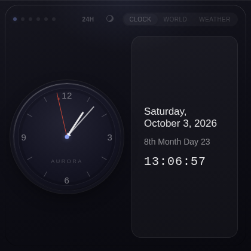
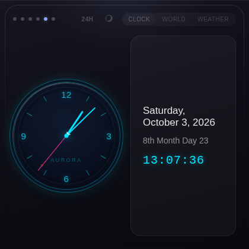
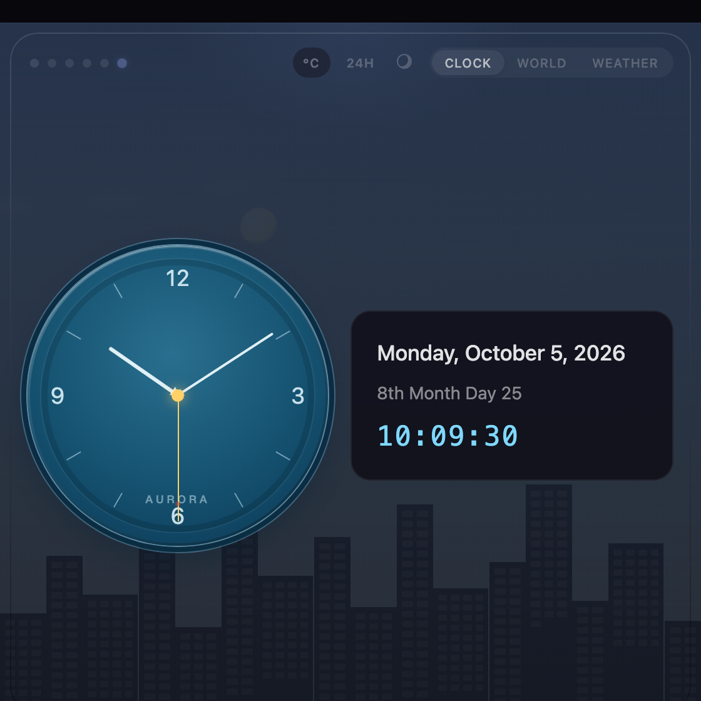
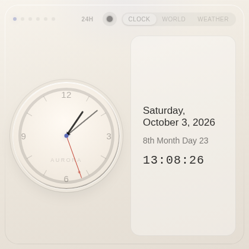
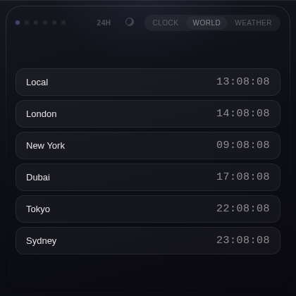
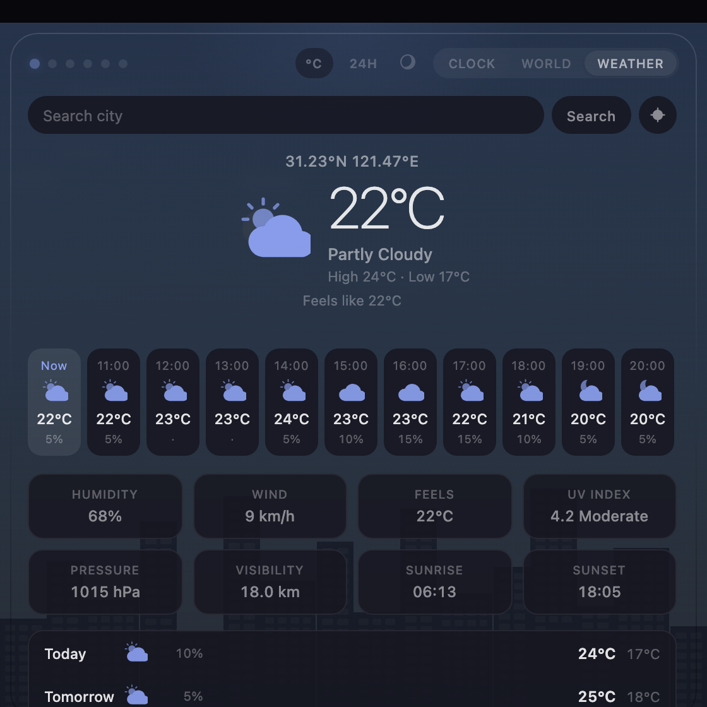

# Aurora Clock

[English](README.md) | 简体中文

Aurora Clock 是一个 Chrome 扩展，提供桌面级表盘时钟，支持多种表盘风格、公历与农历双日期显示，以及实时天气。

当前版本：**1.4.2**

详见 [CHANGELOG](CHANGELOG.zh-CN.md)。

## 界面截图

| 经典 | 霓虹 | 海洋 |
| :---: | :---: | :---: |
|  |  |  |

| 浅色模式 | 世界时钟 | 天气 |
| :---: | :---: | :---: |
|  |  |  |

## 功能特性

- 多种表盘风格：经典、现代、极简、复古、霓虹、海洋
- 指针平滑走动的模拟时钟
- 双日期显示：公历与农历（1900-2049）
- 12 小时制 / 24 小时制切换
- 世界时钟，同时显示本地与主要城市时间
- 基于 Open-Meteo 的实时天气：可搜索任意城市，也可使用浏览器定位
- 键盘快捷键：`Ctrl+Shift+O`（Windows/Linux）或 `Command+Shift+O`（Mac）打开弹窗，`Escape` 关闭
- 通过 `chrome.commands` 管理自定义快捷键
- 深色 / 浅色模式切换
- 精细的金属外圈与表圈质感
- 适配不同弹窗尺寸的响应式布局

## 技术栈

- HTML5
- CSS3（表盘风格、主题、响应式布局）
- JavaScript（时钟逻辑、日期换算、天气请求）
- Chrome Extension API（Manifest V3）

## 安装

### 从 Chrome 应用商店安装

待发布后可用。

### 本地开发安装

1. 克隆或下载本项目
2. 打开 Chrome，进入 `chrome://extensions/`
3. 打开右上角的「开发者模式」
4. 解压发布产物：`unzip -q aurora-clock.zip -d aurora-clock`
5. 点击「加载已解压的扩展程序」，选择上一步生成的 `aurora-clock/` 文件夹
6. 安装完成，工具栏会出现时钟图标

注意这里分两步：源码在仓库根目录，`aurora-clock.zip` 才是给 Chrome 解压用的。详见 [docs/development.zh-CN.md](docs/development.zh-CN.md)。

## 使用说明

### 打开时钟

- 点击工具栏中的时钟图标
- 或使用快捷键 `Ctrl+Shift+O`（Windows/Linux）/ `Command+Shift+O`（Mac）

### 切换表盘风格

- 点击左上角的六个风格圆点
- 从左到右依次为：经典、现代、极简、复古、霓虹、海洋
- 切换立即生效，并在下次打开时恢复

### 查看日期与时间

- 左侧为模拟时钟
- 右侧为公历日期、农历日期与数字时间

### 切换时间制式

- 点击标题栏中的制式按钮，在 `24H` 与 `12H` 之间切换
- 该设置同时作用于数字时间与世界时钟，并在下次打开时恢复

### 查看世界时钟

- 打开 World 标签页
- 每行显示一个城市及其当前本地时间
- `+1d` / `-1d` 标记表示该城市与本地不在同一日历日

### 查看天气

- 打开 Weather 标签页
- 输入城市名搜索，从结果中选取
- 或点击定位按钮，使用浏览器位置
- 通过 °C/°F 按钮切换温度单位，通过 Refresh 手动刷新
- 最近一次成功结果会缓存，在离线、尚未选城市或定位被拒时展示

### 自定义快捷键

- 打开扩展的选项页
- 点击「Set Shortcut」，然后按下包含 Ctrl、Command 或 Alt 的组合键
- 按 Escape 取消

## 权限与隐私

- `storage`：保存主题、表盘风格与最近一次天气结果
- `geolocation`：用于本地天气功能 —— 安装或更新后进行一次后台定位，点击定位按钮时获取一次新的坐标
- `offscreen`：打开一个短生命周期的隐藏文档（唯一拥有 DOM 的 MV3 上下文）以完成定位读取
- Host 权限 `https://api.open-meteo.com/*`：用于天气请求
- Host 权限 `https://geocoding-api.open-meteo.com/*`：用于城市搜索请求
- 你提交的坐标或城市名仅发送给 Open-Meteo，不收集其他数据

完整说明：[隐私政策](docs/privacy-policy.zh-CN.md)

## 项目结构

```
├── icons/              # 扩展图标
├── manifest.json       # 扩展配置（Manifest V3）
├── popup.html          # 弹窗页面结构
├── popup.js            # 时钟、日期、天气与 UI 逻辑
├── styles.css          # 主题、表盘风格、响应式布局
├── options.html        # 快捷键选项页结构
├── options.js          # 快捷键命令更新
├── docs/
│   ├── privacy-policy.md       # 隐私政策（英文）
│   ├── privacy-policy.zh-CN.md # 隐私政策（简体中文）
│   ├── development.md          # 打包与部署流程（英文）
│   ├── development.zh-CN.md    # 打包与部署流程（简体中文）
│   ├── screenshots/            # 弹窗截图（1120x1120，2x）
│   └── store/                  # Chrome 应用商店素材（1280x800）
├── aurora-clock.zip    # 发布产物，由源码打包而来
├── aurora-clock/       # zip 的解压副本；已 gitignore，不是源码
├── README.md           # 文档（英文）
└── README.zh-CN.md     # 文档（简体中文）
```

仓库根目录是唯一的代码修改位置。`aurora-clock/` 是由 `aurora-clock.zip` 解压生成的部署目标 —— 打包与部署流程见 [docs/development.zh-CN.md](docs/development.zh-CN.md)。

## 实现说明

### 时钟

- 通过 `Date` 对象获取当前时间
- 使用 CSS transform 旋转指针
- 使用 `requestAnimationFrame`，秒针平滑走动

### 日期

- 使用 `toLocaleDateString` 格式化公历日期
- 基于紧凑年份表，将公历日期换算为 1900-2049 年的农历日期
- 每分钟刷新一次日期显示

### 天气

- 调用 Open-Meteo 天气预报 API（无需 API Key）
- 通过 Open-Meteo geocoding API 将城市名解析为坐标；仅在你主动要求时使用浏览器定位
- 打开弹窗时绝不请求定位：权限弹窗会关闭弹窗并中断请求
- 安装或更新后不久会通过 offscreen 文档进行一次后台定位，让首次打开弹窗时即可显示当地天气
- 缓存最近一次成功结果，离线或尚未选城市时回退使用
- 每个请求均有 8 秒超时保护，避免界面卡死

### 世界时钟

- 使用 `Intl.DateTimeFormat` 与 IANA 时区，为每个城市渲染一行
- 对比每个城市与本地的日历日，显示 `+1d` / `-1d` 标记
- 跟随当前的 12/24 小时制设置

### 主题

- 通过 `body.light` 类切换深浅色，并存入 `chrome.storage.sync`
- 通过类名切换表盘风格并保存选择

## 浏览器支持

- Chrome 88+（支持 Manifest V3）
- Edge 88+
- 其他基于 Chromium 的浏览器

## 开发计划

- [x] 基于 Open-Meteo 的实时天气
- [x] 快捷键自定义选项页
- [x] 深色 / 浅色模式切换
- [x] 更多表盘风格
- [x] 24 小时 / 12 小时制切换
- [x] 世界时钟

## 许可证

MIT License

## 贡献

欢迎提交 Issue 和 Pull Request。

## 作者

- 项目地址：[https://github.com/sky-jiangcheng/aurora-clock](https://github.com/sky-jiangcheng/aurora-clock)
- 联系方式：jiangcheng1806@gmail.com
